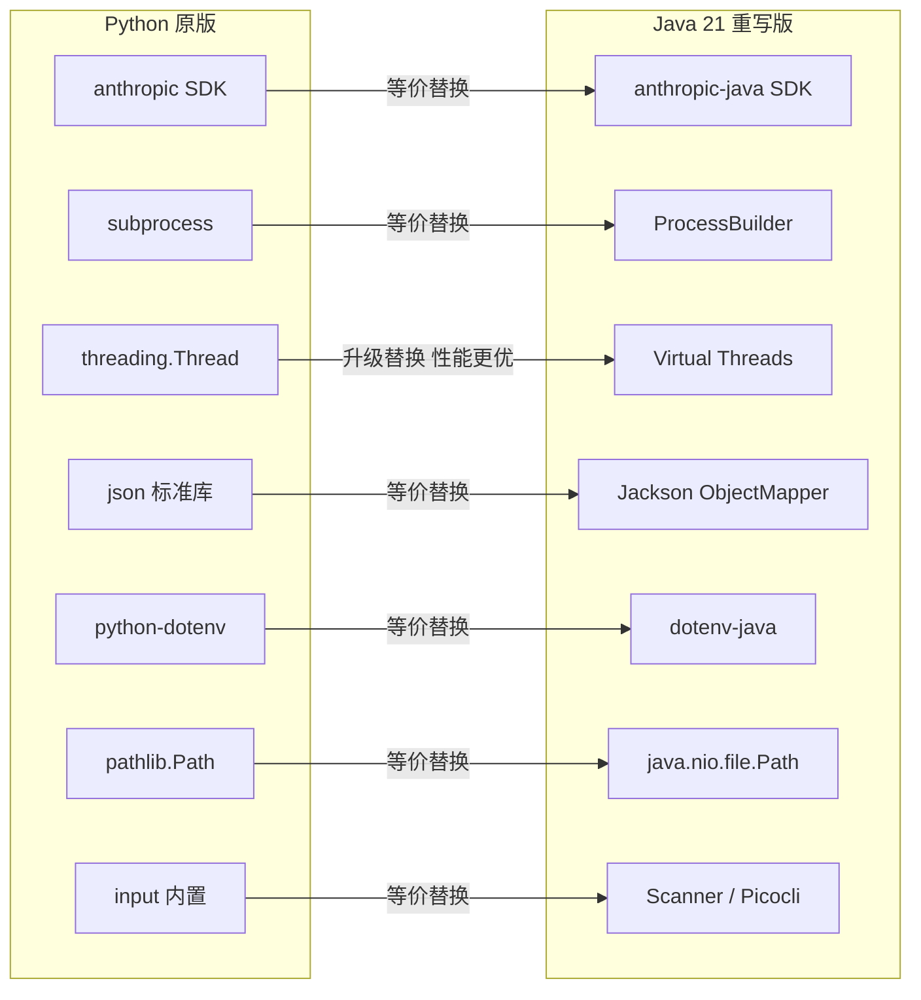
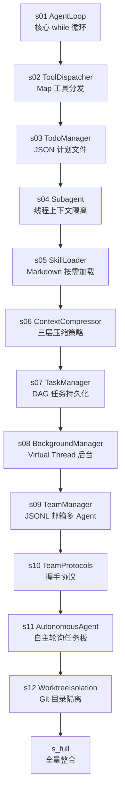
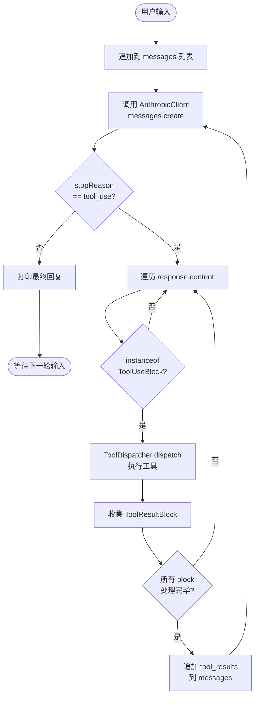
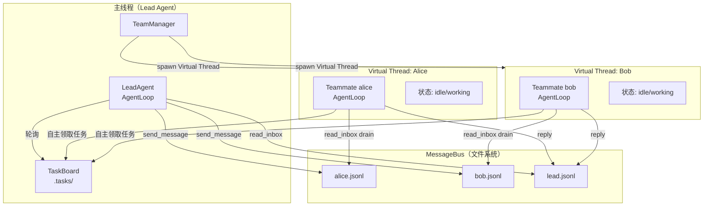
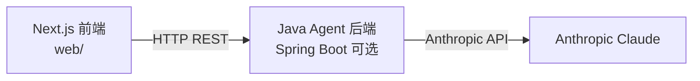
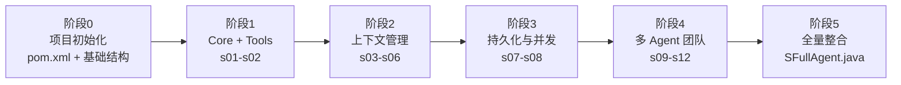

# learn-claude-code Java 重写可行性分析

> 分析目标：`vendors/learn-claude-code`（Python AI Agent 教学项目）
> 分析日期：2026-03-26
> 结论：**完全可行**

---

## 第1章 执行摘要

### 1.1 结论

`learn-claude-code` 项目可以用 Java 完整重写，且 Java 21 在并发（Virtual Threads）和类型安全方面优于原 Python 实现。

项目的核心是 **Harness Engineering**——围绕 LLM 构建最小必要运行环境。其所有机制（Agent 循环、工具分发、子进程、并发、JSON 持久化）在 Java 生态中均有成熟对应实现，没有技术阻碍。

### 1.2 重写范围

| 模块 | 是否重写 | 说明 |
|------|----------|------|
| `agents/` (s01–s12, s_full.py) | ✅ 重写 | 核心内容，共 13 个 Python 文件 |
| `skills/` Markdown 技能文件 | ⏭ 复用 | 纯内容文件，与语言无关 |
| `docs/` 三语言教学文档 | ⏭ 复用 | 纯内容文件，与语言无关 |
| `web/` Next.js 教学平台 | ⏭ 保留 | 前端与后端语言无关 |

### 1.3 推荐技术栈一览

| 用途 | 推荐库/技术 | 原 Python 对应 |
|------|------------|----------------|
| 运行时 | Java 21 LTS | Python 3.10+ |
| Anthropic API | `anthropic-java`（官方） | `anthropic` SDK |
| JSON/JSONL | Jackson 2.x | `json` 标准库 |
| .env 支持 | `dotenv-java` | `python-dotenv` |
| CLI REPL | Picocli 4.x | `input()` 内置 |
| 并发 | Virtual Threads (Java 21) | `threading.Thread` |
| 构建工具 | Maven 3.9+ 或 Gradle 8+ | pip / requirements.txt |
| 日志 | SLF4J + Logback | `print()` |

---

## 第2章 原项目技术栈分析

### 2.1 项目定位

`learn-claude-code` 是一个 **Harness Engineering 教学仓库**，通过逆向工程 Claude Code 的方式，帮助开发者理解 AI Agent 工作原理。

核心哲学：**The Model IS the Agent**——LLM 本身具备 Agent 能力，开发者的职责是提供最小必要的运行支撑（Harness），而非编写复杂的业务逻辑。

### 2.2 渐进式课程结构

项目由 12 个渐进式 Session 组成，每课只增加一个新概念：

| Session | 机制 | 核心类/模式 | 代码量 |
|---------|------|------------|--------|
| s01 | Agent 循环 | `while stop_reason == tool_use` | ~108 行 |
| s02 | 工具分发 | `TOOL_HANDLERS = dict` | ~150 行 |
| s03 | 计划系统 | `TodoManager` (JSON 文件) | ~190 行 |
| s04 | 子 Agent | `run_subagent()` 线程隔离 | ~185 行 |
| s05 | 技能加载 | `SkillLoader` 读 SKILL.md | ~200 行 |
| s06 | 上下文压缩 | 三层 compact 策略 | ~250 行 |
| s07 | 任务系统 | `TaskManager` DAG 文件持久化 | ~320 行 |
| s08 | 后台任务 | `BackgroundManager` + 通知队列 | ~235 行 |
| s09 | Agent 团队 | `TeamManager` + JSONL 邮箱 | ~407 行 |
| s10 | 团队协议 | shutdown/plan 握手协议 | ~450 行 |
| s11 | 自主 Agent | 轮询任务板 + 自我分配 | ~480 行 |
| s12 | 目录隔离 | Git worktree + 索引文件 | ~420 行 |
| s_full | 全量整合 | 所有机制合并 | ~737 行 |

### 2.3 Python 依赖清单

```text
# requirements.txt
anthropic          # Anthropic API 客户端
python-dotenv      # .env 文件加载
```

标准库依赖（无需 pip 安装）：`subprocess`, `threading`, `json`, `pathlib`, `uuid`, `time`, `os`

### 2.4 核心数据结构

所有课程共享同一消息格式（Anthropic Messages API 格式）：

```python
# Python：动态字典
messages = [
    {"role": "user", "content": "query"},
    {"role": "assistant", "content": [ContentBlock, ...]},
    {"role": "user",  "content": [ToolResult, ...]},
]
```

在 Java 中等价结构为：

```java
// Java：强类型记录类
record Message(String role, List<ContentBlock> content) {}

sealed interface ContentBlock permits TextBlock, ToolUseBlock, ToolResultBlock {}
record TextBlock(String type, String text) implements ContentBlock {}
record ToolUseBlock(String type, String id, String name, Map<String,Object> input) implements ContentBlock {}
record ToolResultBlock(String type, String toolUseId, String content) implements ContentBlock {}
```

### 2.5 文件系统状态存储

项目大量使用文件系统作为持久化层（哲学："文件系统是最好的数据库"）：

| 目录/文件 | 内容 | 格式 |
|-----------|------|------|
| `.tasks/<id>.json` | 任务节点（DAG） | JSON |
| `.team/config.json` | 团队成员配置 | JSON |
| `.team/inbox/<name>.jsonl` | Agent 邮箱 | JSONL（每行一条消息） |
| `.transcripts/<ts>.json` | 历史会话转录 | JSON |
| `.worktrees/index.json` | worktree 索引 | JSON |
| `skills/<name>/SKILL.md` | 技能文档 | Markdown |

---

## 第3章 可行性逐项分析

### 3.1 机制对照表

| # | 机制 | Python 实现 | Java 等价实现 | 可行性 | 难度 |
|---|------|------------|--------------|--------|------|
| 1 | Agent 主循环 | `while stop_reason == "tool_use"` | 同等 `while` 循环 | ✅ 完全等价 | 低 |
| 2 | 工具分发 | `dict[str, Callable]` | `Map<String, ToolHandler>` + 函数式接口 | ✅ 等价 | 低 |
| 3 | 子进程执行 | `subprocess.run(shell=True)` | `ProcessBuilder` + `inheritIO` | ✅ 等价 | 低 |
| 4 | 路径沙箱 | `Path.is_relative_to(WORKDIR)` | `path.startsWith(workdir)` | ✅ 完全等价 | 低 |
| 5 | 后台任务 | `threading.Thread` + `list` 队列 | Virtual Thread + `LinkedBlockingQueue` | ✅ 更优 | 低 |
| 6 | JSON 序列化 | `json.loads/dumps` | Jackson `ObjectMapper` | ✅ 等价 | 低 |
| 7 | JSONL 追加写 | `open(f,"a").write(json+"\n")` | `Files.writeString(path, line, APPEND)` | ✅ 等价 | 低 |
| 8 | .env 加载 | `python-dotenv` | `dotenv-java` | ✅ 等价 | 低 |
| 9 | Anthropic API | `anthropic.Anthropic().messages.create()` | `anthropic-java` 官方 SDK | ✅ 官方支持 | 低 |
| 10 | LLM 响应建模 | 动态对象属性访问 | sealed interface + record | ✅ 更类型安全 | 中 |
| 11 | 上下文压缩估算 | `len(str(messages)) // 4` | `objectMapper.writeValueAsString(msgs).length() / 4` | ✅ 等价 | 低 |
| 12 | Git worktree | `subprocess.run("git worktree add")` | `ProcessBuilder("git", "worktree", "add")` | ✅ 等价 | 低 |
| 13 | REPL 交互 | `input(">> ")` | `new Scanner(System.in).nextLine()` | ✅ 等价 | 低 |

**总结：13 项核心机制全部可行，其中 11 项难度为低，2 项为中（仅涉及 Java 类型系统建模）。**

### 3.2 关键机制详细说明

#### 3.2.1 Agent 循环

Python 和 Java 的循环语义完全相同，唯一差异是响应对象的访问方式：

```python
# Python
while True:
    response = client.messages.create(...)
    if response.stop_reason != "tool_use":
        return
    for block in response.content:
        if block.type == "tool_use":
            output = dispatch(block)
```

```java
// Java
while (true) {
    Message response = client.messages().create(params);
    if (!"tool_use".equals(response.stopReason())) return;
    for (ContentBlock block : response.content()) {
        if (block instanceof ToolUseBlock b) {
            String output = dispatch(b);
        }
    }
}
```

#### 3.2.2 Virtual Threads 优势（s08 后台任务）

Python 的 GIL 限制了真正的并行，而 Java 21 的 Virtual Threads 是真正的轻量级线程，无 GIL，支持真正并发：

```python
# Python：受 GIL 限制
thread = threading.Thread(target=run_task, args=(cmd,))
thread.start()
```

```java
// Java 21：Virtual Thread，无 GIL，可真正并行
Thread.ofVirtual().start(() -> runTask(cmd));
```

#### 3.2.3 JSONL 邮箱（s09 Agent 团队）

```python
# Python：追加写 JSONL
with open(inbox_file, "a") as f:
    f.write(json.dumps(message) + "\n")
```

```java
// Java：等价追加写
Files.writeString(inboxPath, objectMapper.writeValueAsString(message) + "\n",
    StandardOpenOption.CREATE, StandardOpenOption.APPEND);
```

### 3.3 风险评估

| 风险项 | 风险等级 | 说明 |
|--------|----------|------|
| anthropic-java SDK 完整性 | 低 | Anthropic 提供官方 Java SDK，API 覆盖完整 |
| 动态类型 → 强类型迁移 | 低-中 | 需要用 sealed interface 建模，一次性工作 |
| Python 动态字典 → Java POJO | 低 | Jackson 支持 Map<String,Object> 灵活映射 |
| subprocess 跨平台行为 | 低 | ProcessBuilder 在 Windows/macOS/Linux 均可用 |

---

## 第4章 推荐 Java 技术栈

### 4.1 核心依赖

```xml
<!-- pom.xml 核心依赖 -->
<dependencies>
  <!-- Anthropic 官方 Java SDK -->
  <dependency>
    <groupId>com.anthropic</groupId>
    <artifactId>anthropic-java</artifactId>
    <version>1.x.x</version>
  </dependency>

  <!-- JSON 处理 -->
  <dependency>
    <groupId>com.fasterxml.jackson.core</groupId>
    <artifactId>jackson-databind</artifactId>
    <version>2.17.x</version>
  </dependency>

  <!-- .env 文件支持 -->
  <dependency>
    <groupId>io.github.cdimascio</groupId>
    <artifactId>dotenv-java</artifactId>
    <version>3.x.x</version>
  </dependency>

  <!-- CLI REPL 交互（可选，替代 Scanner） -->
  <dependency>
    <groupId>info.picocli</groupId>
    <artifactId>picocli</artifactId>
    <version>4.x.x</version>
  </dependency>

  <!-- 日志 -->
  <dependency>
    <groupId>ch.qos.logback</groupId>
    <artifactId>logback-classic</artifactId>
    <version>1.5.x</version>
  </dependency>
</dependencies>
```

### 4.2 Java 版本要求

**最低要求：Java 21 LTS**

使用的 Java 21 特性：

| 特性 | 用途 | 对应 Python 模式 |
|------|------|------------------|
| Virtual Threads | 后台任务、多 Agent 并发 | `threading.Thread` |
| `sealed interface` | ContentBlock 类型层次 | `block.type == "tool_use"` 字符串判断 |
| `record` 类 | 不可变数据模型（Message, Task 等） | `dict` / dataclass |
| Pattern Matching (`instanceof`) | ContentBlock 分派 | `if block.type == "tool_use"` |
| `switch` 表达式 | 工具名称分派 | `TOOL_HANDLERS[name]()` |
| `Files.writeString` (NIO) | JSONL 追加写 | `open(f, "a")` |
| `Path.startsWith` | 路径安全沙箱 | `Path.is_relative_to()` |

### 4.3 技术选型说明

**为什么不用 Spring Boot？**

`learn-claude-code` 的设计哲学是最小依赖，Spring Boot 的 IoC 容器和自动配置与其理念相悖。建议使用纯 Java + Maven，保持与原项目相同的极简风格。若团队已有 Spring 基础，可在 s07 之后引入 Spring Shell 替代 Picocli。

**为什么用 Jackson 而非 Gson？**

Jackson 支持流式 JSONL 解析（`JsonParser` 逐行读取），对 s09 的 JSONL 邮箱处理更高效。

**为什么不用响应式框架（Project Reactor/RxJava）？**

Java 21 Virtual Threads 让同步阻塞代码的性能与响应式代码相当，且代码更易读，更符合原项目的教学目标。

---

## 第5章 架构映射图

### 5.1 Python vs Java 技术栈对比



### 5.2 12 课渐进式模块依赖图



### 5.3 核心 Agent 循环流程图（Java 版）



### 5.4 多 Agent 团队架构图（Java 版）



---

## 第6章 推荐项目结构

```
learn-claude-code-java/
├── pom.xml                          # Maven 构建描述
├── .env.example                     # 环境变量模板（复用原版）
├── .gitignore
├── README.md
│
├── src/main/java/com/example/agent/
│   ├── core/
│   │   ├── AgentLoop.java           # 核心 while 循环（s01 基础）
│   │   ├── ToolHandler.java         # @FunctionalInterface 工具处理接口
│   │   ├── ToolDispatcher.java      # Map<String,ToolHandler> 分发器
│   │   └── ContentBlock.java        # sealed interface + record 类型层次
│   │
│   ├── tools/
│   │   ├── BashTool.java            # ProcessBuilder 执行 shell 命令
│   │   ├── ReadTool.java            # Files.readString
│   │   ├── WriteTool.java           # Files.writeString
│   │   ├── GlobTool.java            # PathMatcher glob 匹配
│   │   └── GrepTool.java            # Files.walkFileTree + 正则
│   │
│   ├── compress/
│   │   └── ContextCompressor.java   # micro/auto/manual 三层压缩（s06）
│   │
│   ├── tasks/
│   │   ├── TodoManager.java         # JSON 文件 Todo 列表（s03）
│   │   ├── TaskManager.java         # DAG 任务图持久化（s07）
│   │   └── Task.java                # record Task(...)
│   │
│   ├── background/
│   │   └── BackgroundManager.java   # Virtual Thread + LinkedBlockingQueue（s08）
│   │
│   ├── team/
│   │   ├── TeamManager.java         # 多 Agent 团队管理（s09）
│   │   ├── MessageBus.java          # JSONL 邮箱读写（s09）
│   │   ├── Teammate.java            # 单个 Agent 线程封装
│   │   └── TeamProtocol.java        # shutdown/plan 握手协议（s10）
│   │
│   ├── worktree/
│   │   └── WorktreeManager.java     # git worktree 隔离（s12）
│   │
│   ├── skills/
│   │   └── SkillLoader.java         # 读取 skills/<name>/SKILL.md（s05）
│   │
│   ├── util/
│   │   ├── PathSandbox.java         # 路径安全检查 path.startsWith(workdir)
│   │   ├── EnvLoader.java           # dotenv-java 封装
│   │   └── TokenEstimator.java      # 粗略 token 估算
│   │
│   └── sessions/
│       ├── S01AgentLoop.java        # main() 入口，演示 s01
│       ├── S02ToolUse.java
│       ├── S03TodoWrite.java
│       ├── S04Subagent.java
│       ├── S05SkillLoading.java
│       ├── S06ContextCompact.java
│       ├── S07TaskSystem.java
│       ├── S08BackgroundTasks.java
│       ├── S09AgentTeams.java
│       ├── S10TeamProtocols.java
│       ├── S11AutonomousAgents.java
│       ├── S12WorktreeIsolation.java
│       └── SFullAgent.java          # 全量整合（对应 s_full.py）
│
├── skills/                          # 复用原项目 Markdown 技能文件（无需修改）
│   ├── agent-builder/SKILL.md
│   ├── code-review/SKILL.md
│   ├── mcp-builder/SKILL.md
│   └── pdf/SKILL.md
│
└── docs/                            # 复用原项目教学文档（无需修改）
    ├── en/
    ├── zh/
    └── ja/
```

---

## 第7章 逐课重写要点

### s01 — Agent 循环

**核心模式：** `while (true)` + `ProcessBuilder`

```python
# Python
def run_bash(command):
    r = subprocess.run(command, shell=True, capture_output=True, text=True, timeout=120)
    return (r.stdout + r.stderr).strip()[:50000]

def agent_loop(messages):
    while True:
        response = client.messages.create(model=MODEL, messages=messages, tools=TOOLS)
        messages.append({"role": "assistant", "content": response.content})
        if response.stop_reason != "tool_use":
            return
        results = []
        for block in response.content:
            if block.type == "tool_use":
                output = run_bash(block.input["command"])
                results.append({"type": "tool_result", "tool_use_id": block.id, "content": output})
        messages.append({"role": "user", "content": results})
```

```java
// Java
public String runBash(String command) throws IOException, InterruptedException {
    ProcessBuilder pb = new ProcessBuilder("bash", "-c", command)
        .redirectErrorStream(true);
    Process p = pb.start();
    String out = new String(p.getInputStream().readAllBytes());
    p.waitFor(120, TimeUnit.SECONDS);
    return out.length() > 50000 ? out.substring(0, 50000) : out;
}

public void agentLoop(List<Message> messages) {
    while (true) {
        MessageCreateResponse response = client.messages().create(params(messages));
        messages.add(new Message("assistant", response.content()));
        if (!"tool_use".equals(response.stopReason())) return;
        List<ToolResultBlock> results = new ArrayList<>();
        for (ContentBlock block : response.content()) {
            if (block instanceof ToolUseBlock b) {
                String output = runBash((String) b.input().get("command"));
                results.add(new ToolResultBlock("tool_result", b.id(), output));
            }
        }
        messages.add(new Message("user", List.copyOf(results)));
    }
}
```

### s02 — 工具分发与路径沙箱

**核心模式：** `Map<String, ToolHandler>` + `PathSandbox`

```python
# Python
TOOL_HANDLERS = {
    "bash":      lambda **kw: run_bash(kw["command"]),
    "read_file": lambda **kw: read_file(kw["path"]),
    "write_file":lambda **kw: write_file(kw["path"], kw["content"]),
}

def safe_path(p):
    path = (WORKDIR / p).resolve()
    if not path.is_relative_to(WORKDIR):
        raise ValueError(f"Path escapes workspace: {p}")
    return path
```

```java
// Java
@FunctionalInterface
public interface ToolHandler {
    String handle(Map<String, Object> input) throws Exception;
}

Map<String, ToolHandler> toolHandlers = Map.of(
    "bash",       input -> bashTool.run((String) input.get("command")),
    "read_file",  input -> readTool.read((String) input.get("path")),
    "write_file", input -> writeTool.write((String) input.get("path"),
                                           (String) input.get("content"))
);

// PathSandbox.java
public Path safePath(String p) {
    Path resolved = workdir.resolve(p).normalize();
    if (!resolved.startsWith(workdir))
        throw new SecurityException("Path escapes workspace: " + p);
    return resolved;
}
```

### s04 — 子 Agent（上下文隔离）

**核心模式：** `CompletableFuture` 或 Virtual Thread，子 Agent 使用独立 messages 列表

```python
# Python：子 Agent 用独立 messages=[]
def run_subagent(prompt):
    sub_messages = [{"role": "user", "content": prompt}]
    sub_agent_loop(sub_messages)  # 完全独立上下文
    for block in reversed(sub_messages[-1]["content"]):
        if hasattr(block, "text"):
            return block.text
    return "(no result)"
```

```java
// Java：Virtual Thread 运行子 Agent，返回摘要
public String runSubagent(String prompt) throws Exception {
    List<Message> subMessages = new ArrayList<>();
    subMessages.add(new Message("user", prompt));
    // 子 Agent 使用全新的独立消息列表，与父 Agent 完全隔离
    var future = CompletableFuture.supplyAsync(() -> {
        agentLoop(subMessages);  // 在独立上下文中运行
        return extractLastText(subMessages);
    }, Thread.ofVirtual().factory());
    return future.get(300, TimeUnit.SECONDS);
}
```

### s06 — 上下文压缩（三层策略）

**核心模式：** 三层 compactor，token 估算 + LLM 摘要调用

```java
// Java：ContextCompressor.java
public class ContextCompressor {
    private static final int THRESHOLD = 50_000;
    private static final int KEEP_RECENT = 3;

    // Layer 1：micro compact — 用占位符替换旧工具结果
    public List<Message> microCompact(List<Message> messages) {
        // 找出所有 tool_result，保留最新 KEEP_RECENT 个，其余替换为占位符
        // ...
    }

    // Layer 2：auto compact — token 超限时自动摘要
    public List<Message> autoCompact(List<Message> messages) {
        if (estimateTokens(messages) < THRESHOLD) return messages;
        saveTranscript(messages);  // 保存到 .transcripts/
        String summary = callLlmSummarize(messages);  // 调用 LLM 摘要
        List<Message> compacted = new ArrayList<>();
        compacted.add(new Message("user", "[Previous conversation summary]: " + summary));
        compacted.add(new Message("assistant", "Understood. Continuing from summary."));
        return compacted;
    }

    // token 粗估：字符数 / 4
    public int estimateTokens(List<Message> messages) {
        return objectMapper.writeValueAsString(messages).length() / 4;
    }
}
```

### s07 — 任务系统（文件持久化 DAG）

**核心模式：** 每个 Task 存为独立 JSON 文件，Jackson 序列化

```java
// Java：Task.java
public record Task(
    String id, String subject, String description,
    String status,  // pending | in_progress | completed | deleted
    String owner,
    List<String> blockedBy,
    List<String> blocks
) {}

// TaskManager.java — 文件持久化
public class TaskManager {
    private final Path tasksDir;  // .tasks/

    public Task create(String subject, String description) throws IOException {
        Task task = new Task(UUID.randomUUID().toString().substring(0,8),
            subject, description, "pending", null, List.of(), List.of());
        Path file = tasksDir.resolve(task.id() + ".json");
        Files.writeString(file, objectMapper.writeValueAsString(task));
        return task;
    }

    public Task update(String id, String status) throws IOException {
        Path file = tasksDir.resolve(id + ".json");
        Task old = objectMapper.readValue(file.toFile(), Task.class);
        Task updated = new Task(old.id(), old.subject(), old.description(),
            status, old.owner(), old.blockedBy(), old.blocks());
        Files.writeString(file, objectMapper.writeValueAsString(updated));
        return updated;
    }
}
```

### s08 — 后台任务（Virtual Thread + BlockingQueue）

**核心模式：** `LinkedBlockingQueue` 作为通知队列，Virtual Thread 执行任务

```java
// Java：BackgroundManager.java
public class BackgroundManager {
    record TaskInfo(String id, String status, String result, String command) {}

    private final Map<String, TaskInfo> tasks = new ConcurrentHashMap<>();
    private final BlockingQueue<String> notificationQueue = new LinkedBlockingQueue<>();

    public String run(String command) {
        String taskId = UUID.randomUUID().toString().substring(0, 8);
        tasks.put(taskId, new TaskInfo(taskId, "running", null, command));
        Thread.ofVirtual().start(() -> {
            try {
                String result = bashTool.run(command);
                tasks.put(taskId, new TaskInfo(taskId, "done", result, command));
            } catch (Exception e) {
                tasks.put(taskId, new TaskInfo(taskId, "error", e.getMessage(), command));
            }
            notificationQueue.offer(taskId);  // 入队通知
        });
        return taskId;  // 立即返回，不阻塞
    }

    // 在每次 LLM 调用前 drain 通知队列
    public List<String> drainNotifications() {
        List<String> done = new ArrayList<>();
        notificationQueue.drainTo(done);
        return done;
    }
}
```

### s09 — Agent 团队（JSONL 邮箱）

**核心模式：** `Files.writeString(APPEND)` 实现 JSONL 追加，Virtual Thread 每个 Agent 一个

```java
// Java：MessageBus.java
public class MessageBus {
    private final Path inboxDir;  // .team/inbox/

    public void send(String to, Map<String, Object> message) throws IOException {
        Path inbox = inboxDir.resolve(to + ".jsonl");
        String line = objectMapper.writeValueAsString(message) + "\n";
        Files.writeString(inbox, line, StandardOpenOption.CREATE, StandardOpenOption.APPEND);
    }

    // drain 语义：读取后清空
    public List<Map<String,Object>> readAndDrain(String name) throws IOException {
        Path inbox = inboxDir.resolve(name + ".jsonl");
        if (!Files.exists(inbox)) return List.of();
        List<String> lines = Files.readAllLines(inbox);
        Files.writeString(inbox, "");  // 清空
        return lines.stream()
            .filter(l -> !l.isBlank())
            .map(l -> objectMapper.readValue(l, Map.class))
            .toList();
    }
}
```

### s12 — Git Worktree 目录隔离

**核心模式：** `ProcessBuilder` 执行 `git worktree add`，索引文件记录映射

```java
// Java：WorktreeManager.java
public class WorktreeManager {
    public String create(String taskId) throws IOException, InterruptedException {
        Path worktreePath = workdir.resolve(".worktrees").resolve(taskId);
        // git worktree add <path> -b <branch>
        new ProcessBuilder("git", "worktree", "add",
            worktreePath.toString(), "-b", "task-" + taskId)
            .directory(workdir.toFile())
            .inheritIO().start().waitFor();
        updateIndex(taskId, worktreePath);  // 写入 .worktrees/index.json
        return worktreePath.toString();
    }

    public void remove(String taskId) throws IOException, InterruptedException {
        Path worktreePath = workdir.resolve(".worktrees").resolve(taskId);
        new ProcessBuilder("git", "worktree", "remove", "--force",
            worktreePath.toString())
            .directory(workdir.toFile())
            .inheritIO().start().waitFor();
        removeFromIndex(taskId);
    }
}
```

---

## 第8章 关键挑战与应对方案

### 8.1 动态类型 → 强类型建模

**挑战：** Python 用字符串 `block.type == "tool_use"` 做运行时分派，Java 需要静态类型层次。

**方案：** `sealed interface` + `record` + pattern matching

```java
// sealed interface 强制穷举所有子类型
public sealed interface ContentBlock
    permits TextBlock, ToolUseBlock, ToolResultBlock {}

public record TextBlock(String type, String text) implements ContentBlock {}
public record ToolUseBlock(String type, String id, String name,
                           Map<String, Object> input) implements ContentBlock {}
public record ToolResultBlock(String type, String toolUseId,
                              String content) implements ContentBlock {}

// 分派时使用 pattern matching（Java 21）
switch (block) {
    case ToolUseBlock b  -> dispatch(b);
    case TextBlock b     -> print(b.text());
    case ToolResultBlock b -> {}  // 通常不出现在 assistant 回复中
}
```

一次性建模，所有 Session 复用，无运行时 ClassCastException 风险。

### 8.2 同步 vs 异步选择

**挑战：** Python 使用同步 `threading.Thread`，Anthropic API 调用会阻塞线程。

**方案：** Java 21 Virtual Threads 使同步阻塞代码性能与异步相当，**优先使用同步代码**：

```java
// 推荐：同步代码 + Virtual Thread 执行器
ExecutorService executor = Executors.newVirtualThreadPerTaskExecutor();
executor.submit(() -> {
    // 普通同步阻塞代码，由 Virtual Thread 托管，不占用平台线程
    String result = client.messages().create(params).toString();
});
```

不建议引入 Project Reactor 或 RxJava，会破坏原项目的教学简洁性。

### 8.3 REPL 交互实现

**挑战：** Python `input("s01 >> ")` 内置支持彩色提示符和 EOF 处理。

**方案：** 基础版用 `Scanner`，进阶版用 JLine3（支持历史记录和彩色）：

```java
// 基础版（对应 s01-s06）
Scanner scanner = new Scanner(System.in);
System.out.print("\033[36ms01 >> \033[0m");
String query = scanner.nextLine();

// 进阶版（对应 s09+ 多 Agent）：JLine3 库
Terminal terminal = TerminalBuilder.terminal();
LineReader reader = LineReaderBuilder.builder().terminal(terminal).build();
String query = reader.readLine("\033[36ms09 >> \033[0m");
```

### 8.4 anthropic-java SDK API 差异

**挑战：** Python SDK 和 Java SDK 的 API 风格有差异（Builder 模式 vs 关键字参数）。

```python
# Python SDK
response = client.messages.create(
    model="claude-opus-4-6",
    system="You are...",
    messages=messages,
    tools=tools,
    max_tokens=8000,
)
```

```java
// Java SDK（Builder 模式）
MessageCreateParams params = MessageCreateParams.builder()
    .model(Model.CLAUDE_OPUS_4_6)
    .system("You are...")
    .messages(messages)
    .tools(tools)
    .maxTokens(8000)
    .build();
Message response = client.messages().create(params);
```

差异仅在 API 调用风格，语义完全一致。建议封装一个 `AnthropicHelper` 工具类统一管理。

### 8.5 JSONL 并发写入安全

**挑战：** s09 多个 Agent 线程可能同时写同一 JSONL 邮箱文件。

**方案：** 使用 `ReentrantLock` 或 `synchronized` 保护文件写操作：

```java
public class MessageBus {
    private final Map<String, ReentrantLock> locks = new ConcurrentHashMap<>();

    public void send(String to, Map<String, Object> message) throws IOException {
        ReentrantLock lock = locks.computeIfAbsent(to, k -> new ReentrantLock());
        lock.lock();
        try {
            Path inbox = inboxDir.resolve(to + ".jsonl");
            Files.writeString(inbox,
                objectMapper.writeValueAsString(message) + "\n",
                StandardOpenOption.CREATE, StandardOpenOption.APPEND);
        } finally {
            lock.unlock();
        }
    }
}
```

Python 原版依赖 GIL 隐式保护，Java 需要显式锁，这是 Java 版的额外优势（行为更可预期）。

---

## 第9章 不建议重写的部分

| 模块 | 建议 | 原因 |
|------|------|------|
| `web/` Next.js 教学平台 | 直接保留 | 前端与后端语言无关；Next.js 生态成熟，无 Java 等价方案值得替换 |
| `skills/*.md` 技能文件 | 直接复用 | 纯 Markdown 内容，Java 版 `SkillLoader` 直接读取 |
| `docs/en|zh|ja/*.md` 文档 | 直接复用 | 内容层与实现语言无关 |
| `.env.example` | 直接复用 | 格式兼容 `dotenv-java` |

### Web 平台与 Java 后端的集成方式（可选）

若未来希望将 Java Agent 后端与 Next.js 前端集成，可通过 HTTP API 桥接：



---

## 第10章 总结与实施建议

### 10.1 总体结论

`learn-claude-code` 项目**完全可以用 Java 重写**。所有 13 项核心机制均有成熟的 Java 对应实现，无技术阻碍。Java 21 的 Virtual Threads 在并发场景（s08–s12）甚至优于 Python threading，强类型系统也使代码更加健壮。

### 10.2 代码量预估

| 模块 | 预估 Java 代码量 | 原 Python 代码量 |
|------|-----------------|------------------|
| core（AgentLoop, ToolDispatcher） | ~200 行 | ~150 行 |
| tools（Bash, Read, Write 等） | ~300 行 | ~200 行 |
| sessions（s01–s12 主类） | ~800 行 | ~2500 行 |
| compress/tasks/background/team | ~600 行 | ~500 行 |
| util + worktree + skills | ~300 行 | ~150 行 |
| **合计** | **~2200 行** | **~3500 行** |

Java 版代码量少于 Python 版，因为 Java 的 `record`、`sealed interface` 和 `Map.of()` 等特性减少了样板代码，同时 anthropic-java SDK 封装了更多细节。

### 10.3 实施路线图



**建议按 s01 → s12 顺序逐课实现**，每课作为独立可运行的 `main()` 程序，保持与原项目相同的教学节奏。

### 10.4 最终建议

1. **Java 21 作为最低版本**，充分利用 Virtual Threads、record、sealed interface 和 pattern matching。
2. **保持极简依赖**（anthropic-java + Jackson + dotenv-java），不引入 Spring Boot 等重框架。
3. **复用所有内容文件**（skills/, docs/, .env.example），只重写 agents/ 部分。
4. **每课保留对应 Python 代码注释**，便于对照学习，强化教学价值。
5. **优先同步代码**，用 Virtual Thread 解决并发，避免响应式编程带来的学习曲线。

---

*文档生成日期：2026-03-26*
*源码分析对象：`vendors/learn-claude-code/`（Python 原版）*
*分析依据：s01–s12 全部源码 + learn-claude-code-arch.md 架构文档*


