# learn-claude-code Java 重写实施计划

> 依据文档：`specs/java-rewrite-analysis.md`
> 计划日期：2026-03-27
> 实施目标：将 `vendors/learn-claude-code` 的 agents/ 模块用 Java 21 完整重写

---

## 第1章 实施概览

### 1.1 目标

将 `learn-claude-code` 的 13 个 Python Agent 文件（s01–s12 + s_full.py）用 Java 21 重写，保持原项目的渐进式教学结构和 Harness Engineering 理念，同时复用所有内容文件（skills/、docs/、web/）。

### 1.2 核心原则

| 原则 | 说明 |
|------|------|
| 最小依赖 | 仅引入 anthropic-java、Jackson、dotenv-java，不使用 Spring Boot |
| 渐进教学 | 每课独立可运行，每课只增加一个新概念 |
| 同步优先 | 用 Virtual Threads 代替响应式编程，代码更易读 |
| 内容复用 | skills/、docs/、web/ 目录原样保留 |
| 教学对齐 | 每个 Java 类保留对应 Python 代码注释，便于对照学习 |

### 1.3 实施阶段总览

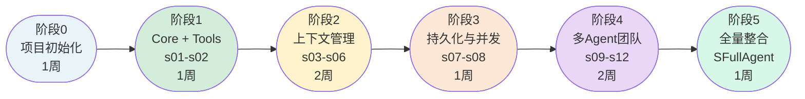

### 1.4 工期与代码量预估

| 阶段 | 内容 | 工期 | 预估代码量 |
|------|------|------|------------|
| 阶段0 | 项目初始化 + 基础设施 | 1 周 | ~150 行 |
| 阶段1 | Core + Tools（s01-s02） | 1 周 | ~500 行 |
| 阶段2 | 上下文管理（s03-s06） | 2 周 | ~550 行 |
| 阶段3 | 持久化与并发（s07-s08） | 1 周 | ~400 行 |
| 阶段4 | 多 Agent 团队（s09-s12） | 2 周 | ~700 行 |
| 阶段5 | 全量整合（SFullAgent） | 1 周 | ~300 行 |
| **合计** | | **8 周** | **~2600 行** |

---

## 第2章 甘特图

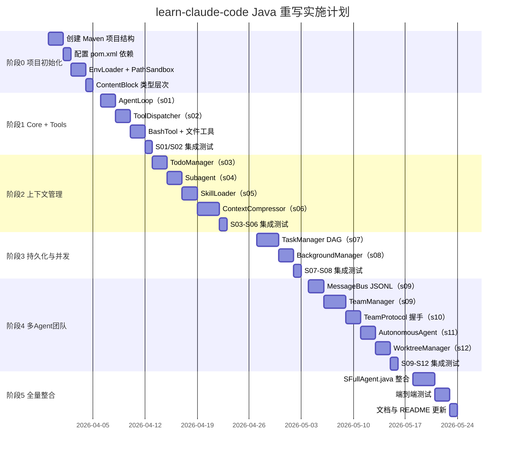

---

## 第3章 阶段0：项目初始化

### 3.1 任务清单

- [ ] 创建 Maven 项目目录结构
- [ ] 配置 `pom.xml`（依赖、编译器版本、插件）
- [ ] 创建 `.env.example`（复用原版）
- [ ] 实现 `EnvLoader.java`（dotenv-java 封装）
- [ ] 实现 `PathSandbox.java`（路径安全检查）
- [ ] 实现 `TokenEstimator.java`（粗略 token 估算）
- [ ] 定义 `ContentBlock` sealed interface 类型层次
- [ ] 配置 `AnthropicClient` 工厂方法

### 3.2 目录结构

```
learn-claude-code-java/
├── pom.xml
├── .env.example
├── .gitignore
├── README.md
└── src/
    └── main/
        └── java/
            └── com/example/agent/
                ├── core/
                │   ├── AgentLoop.java
                │   ├── ContentBlock.java      ← sealed interface
                │   ├── ToolHandler.java       ← @FunctionalInterface
                │   └── ToolDispatcher.java
                ├── tools/
                │   ├── BashTool.java
                │   ├── ReadTool.java
                │   ├── WriteTool.java
                │   ├── EditTool.java
                │   ├── GlobTool.java
                │   └── GrepTool.java
                ├── compress/
                │   └── ContextCompressor.java
                ├── tasks/
                │   ├── TodoManager.java
                │   ├── TaskManager.java
                │   └── Task.java
                ├── background/
                │   └── BackgroundManager.java
                ├── team/
                │   ├── TeamManager.java
                │   ├── MessageBus.java
                │   ├── Teammate.java
                │   └── TeamProtocol.java
                ├── worktree/
                │   └── WorktreeManager.java
                ├── skills/
                │   └── SkillLoader.java
                ├── util/
                │   ├── PathSandbox.java
                │   ├── EnvLoader.java
                │   └── TokenEstimator.java
                └── sessions/
                    ├── S01AgentLoop.java
                    ├── S02ToolUse.java
                    ├── S03TodoWrite.java
                    ├── S04Subagent.java
                    ├── S05SkillLoading.java
                    ├── S06ContextCompact.java
                    ├── S07TaskSystem.java
                    ├── S08BackgroundTasks.java
                    ├── S09AgentTeams.java
                    ├── S10TeamProtocols.java
                    ├── S11AutonomousAgents.java
                    ├── S12WorktreeIsolation.java
                    └── SFullAgent.java
```

### 3.3 pom.xml 核心配置

```xml
<properties>
  <java.version>21</java.version>
  <maven.compiler.source>21</maven.compiler.source>
  <maven.compiler.target>21</maven.compiler.target>
  <maven.compiler.enablePreview>true</maven.compiler.enablePreview>
</properties>

<dependencies>
  <dependency>
    <groupId>com.anthropic</groupId>
    <artifactId>anthropic-java</artifactId>
    <version>1.2.0</version>
  </dependency>
  <dependency>
    <groupId>com.fasterxml.jackson.core</groupId>
    <artifactId>jackson-databind</artifactId>
    <version>2.17.2</version>
  </dependency>
  <dependency>
    <groupId>io.github.cdimascio</groupId>
    <artifactId>dotenv-java</artifactId>
    <version>3.0.2</version>
  </dependency>
  <dependency>
    <groupId>info.picocli</groupId>
    <artifactId>picocli</artifactId>
    <version>4.7.6</version>
  </dependency>
  <dependency>
    <groupId>ch.qos.logback</groupId>
    <artifactId>logback-classic</artifactId>
    <version>1.5.6</version>
  </dependency>
</dependencies>
```

### 3.4 验收标准

- [ ] `mvn compile` 通过，无编译错误
- [ ] `EnvLoader` 能正确读取 `.env` 文件中的 `ANTHROPIC_API_KEY` 和 `MODEL_ID`
- [ ] `PathSandbox.safePath()` 对工作区外路径抛出 `SecurityException`
- [ ] `ContentBlock` sealed interface 有 3 个子类型（TextBlock、ToolUseBlock、ToolResultBlock）

---

## 第4章 阶段1：Core + Tools（s01-s02）

### 4.1 任务清单

- [ ] 实现 `AgentLoop.java`——核心 while 循环
- [ ] 实现 `ToolHandler.java`——`@FunctionalInterface` 工具接口
- [ ] 实现 `ToolDispatcher.java`——`Map<String, ToolHandler>` 分发器
- [ ] 实现 `BashTool.java`——ProcessBuilder 子进程执行
- [ ] 实现 `ReadTool.java`、`WriteTool.java`、`EditTool.java`
- [ ] 实现 `S01AgentLoop.java`——独立可运行 main()
- [ ] 实现 `S02ToolUse.java`——工具分发演示

### 4.2 关键设计决策

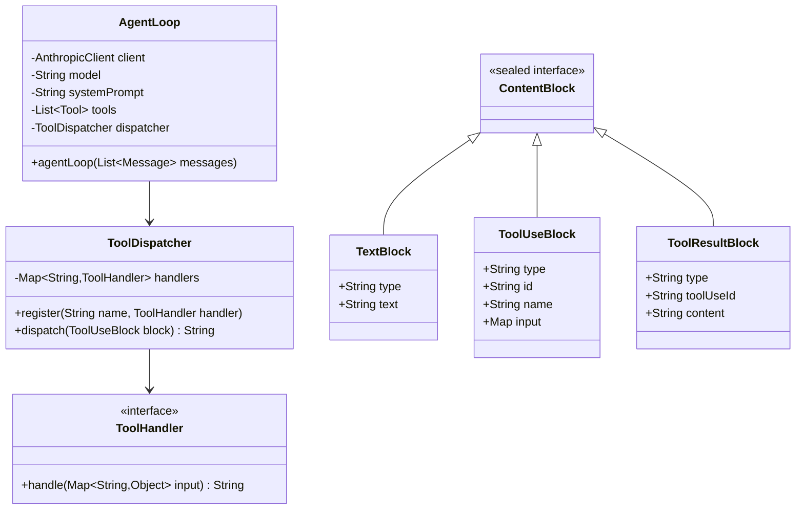

### 4.3 验收标准

- [ ] `S01AgentLoop` 能正常启动 REPL，接受用户输入并执行 bash 命令
- [ ] `S02ToolUse` 支持 bash/read_file/write_file/edit_file 四个工具
- [ ] `PathSandbox` 阻止工作区外路径访问
- [ ] bash 超时（120s）正确处理
- [ ] 输出前 200 字符的工具调用日志

---

## 第5章 阶段2：上下文管理（s03-s06）

### 5.1 任务清单

- [ ] 实现 `TodoManager.java`（s03）——JSON 内存 Todo 列表，最多 20 项
- [ ] 实现 Subagent 机制（s04）——`CompletableFuture` + Virtual Thread 独立上下文
- [ ] 实现 `SkillLoader.java`（s05）——读取 `skills/*/SKILL.md`，解析 YAML frontmatter
- [ ] 实现 `ContextCompressor.java`（s06）——三层压缩策略
- [ ] 实现 `S03TodoWrite.java` ~ `S06ContextCompact.java` 各课独立主类

### 5.2 ContextCompressor 三层压缩流程

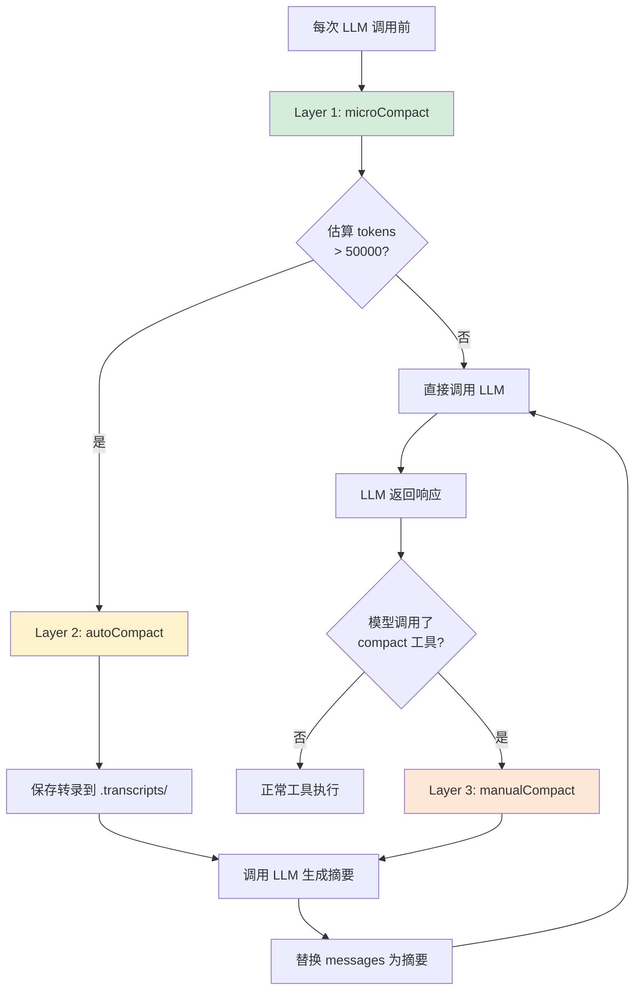

### 5.3 microCompact 算法说明

遍历所有 `tool_result` 消息，保留最新 3 条，将更早的内容替换为占位符：

```
"[Previous: used bash]"
```

此操作在每次 LLM 调用前静默执行，用户无感知。

### 5.4 验收标准

- [ ] `TodoManager` 强制最多 1 个 `in_progress` 状态项
- [ ] Subagent 使用独立 `new ArrayList<>()` 上下文，父 Agent 上下文不污染
- [ ] `SkillLoader` 正确解析 `skills/agent-builder/SKILL.md` 的 frontmatter
- [ ] `ContextCompressor.estimateTokens()` 返回合理值（字符数 / 4）
- [ ] autoCompact 后 `.transcripts/` 目录有对应 JSON 文件
- [ ] S06 在 token 超过阈值时自动触发压缩日志输出 `[auto_compact triggered]`

---

## 第6章 阶段3：持久化与并发（s07-s08）

### 6.1 任务清单

- [ ] 实现 `Task.java` record 类
- [ ] 实现 `TaskManager.java`（s07）——文件持久化 DAG，`.tasks/task_N.json`
- [ ] 实现 `BackgroundManager.java`（s08）——Virtual Thread + `LinkedBlockingQueue`
- [ ] 实现 `S07TaskSystem.java`、`S08BackgroundTasks.java` 独立主类

### 6.2 TaskManager 状态机

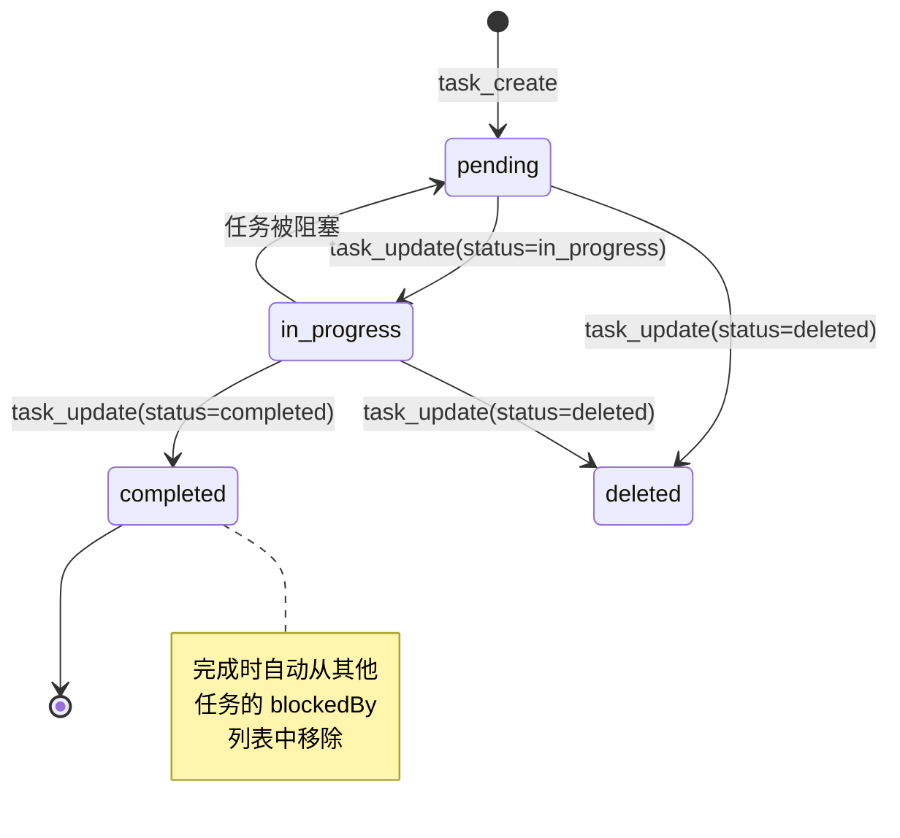

### 6.3 BackgroundManager 并发模型

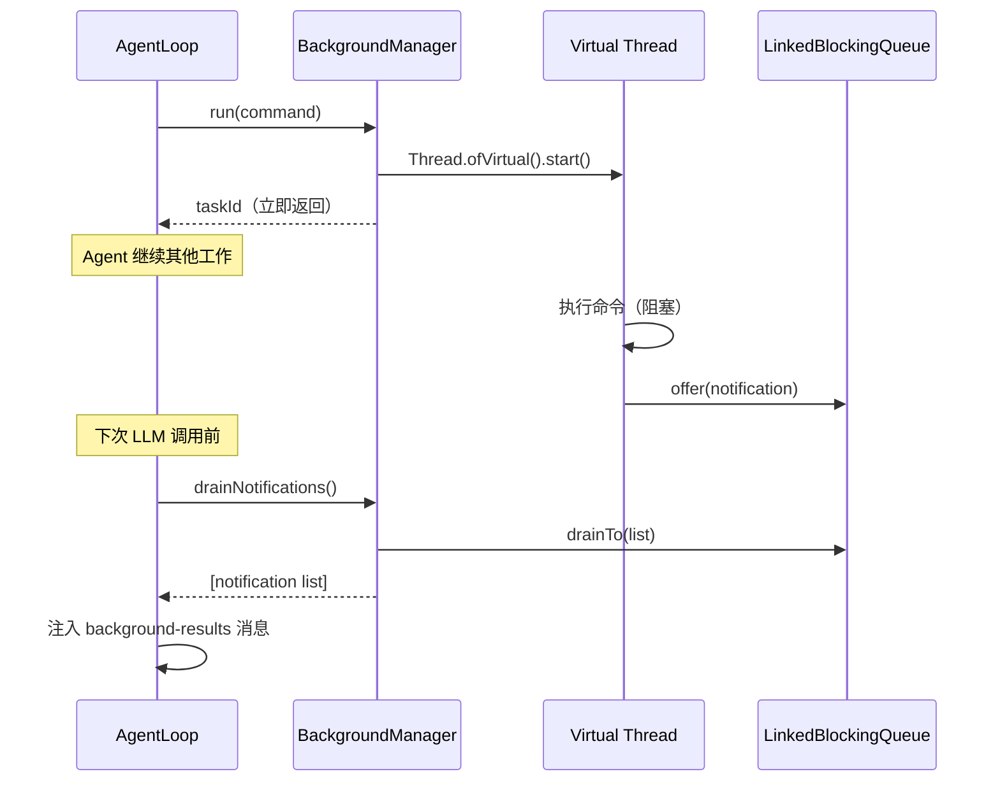

### 6.4 验收标准

- [ ] `TaskManager.create()` 在 `.tasks/` 目录生成对应 JSON 文件
- [ ] 完成任务后，其他任务的 `blockedBy` 列表自动更新
- [ ] `BackgroundManager.run()` 立即返回 taskId，不阻塞 Agent 循环
- [ ] 后台任务完成后，下一轮 LLM 调用前自动注入 `<background-results>` 消息
- [ ] S07/S08 的 REPL 交互正常运行

---

## 第7章 阶段4：多 Agent 团队（s09-s12）

### 7.1 任务清单

- [ ] 实现 `MessageBus.java`（s09）——JSONL 邮箱，`ReentrantLock` 并发安全
- [ ] 实现 `Teammate.java`——单个 Agent 线程封装（Virtual Thread）
- [ ] 实现 `TeamManager.java`（s09）——团队配置持久化（`.team/config.json`）
- [ ] 实现 `TeamProtocol.java`（s10）——shutdown / plan_approval 握手
- [ ] 实现 `AutonomousAgent` 机制（s11）——空闲轮询 + 自动认领任务
- [ ] 实现 `WorktreeManager.java`（s12）——git worktree 创建/运行/移除 + 事件日志
- [ ] 实现 S09-S12 各课独立主类

### 7.2 多 Agent 通信架构

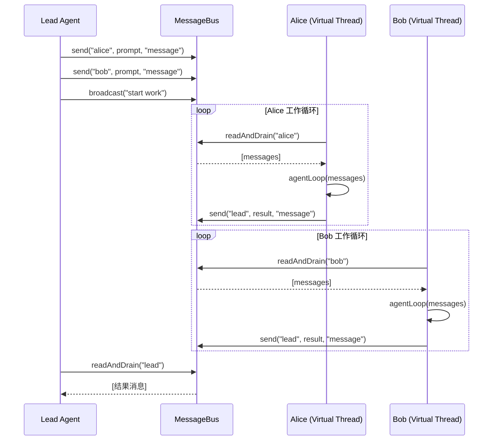

### 7.3 Shutdown 握手协议（s10）

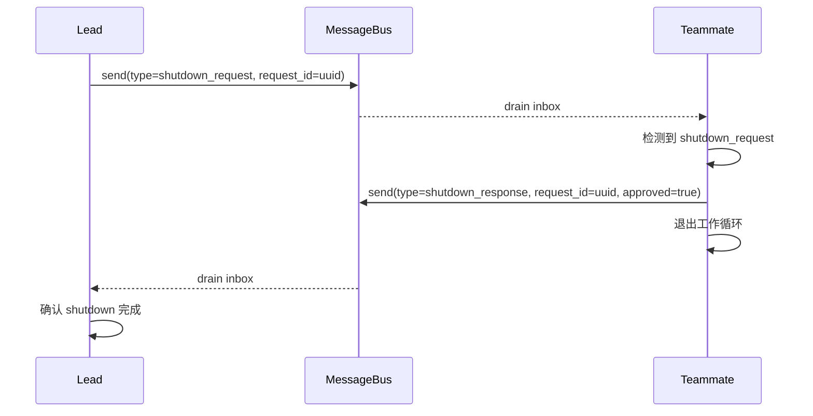

### 7.4 自主 Agent 任务认领流程（s11）

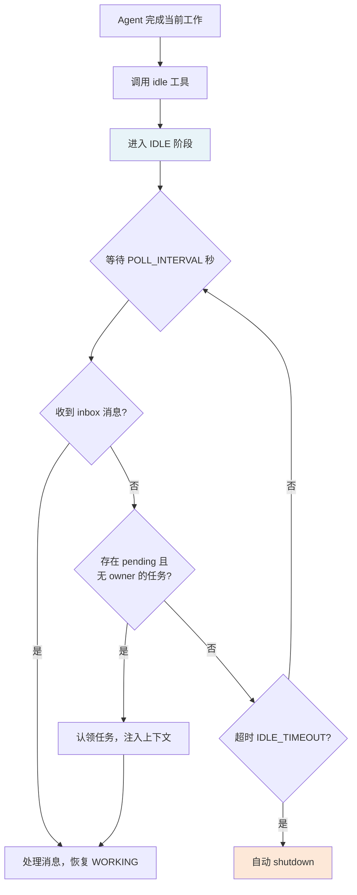

### 7.5 Worktree 生命周期（s12）

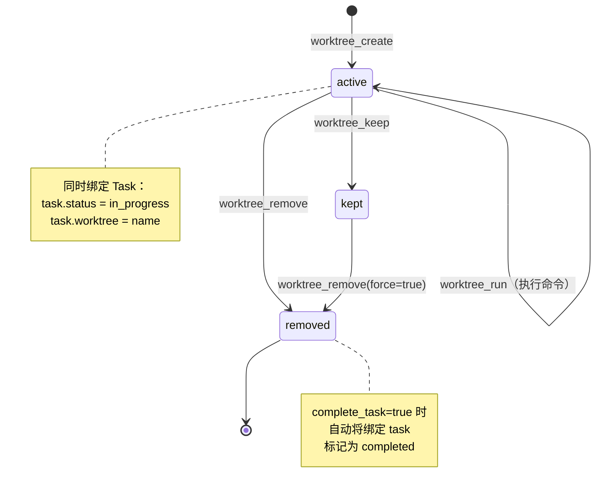

### 7.6 验收标准

- [ ] 两个 Teammate 能并发运行，互不干扰（各自独立 messages 列表）
- [ ] JSONL 邮箱的并发写入通过 `ReentrantLock` 保护，无数据竞争
- [ ] shutdown_request 握手在 30s 内完成
- [ ] s11 自主 Agent 能从任务板认领任务并完成
- [ ] `WorktreeManager` 能创建 git worktree、在其中执行命令、并正确移除
- [ ] 事件日志写入 `.worktrees/events.jsonl`

---

## 第8章 阶段5：全量整合（SFullAgent）

### 8.1 任务清单

- [ ] 实现 `SFullAgent.java`——整合所有机制的全量参考实现
- [ ] 支持 REPL 命令：`/compact`、`/tasks`、`/team`、`/inbox`
- [ ] 集成 s03 TodoManager nag reminder（3 轮未更新则提示）
- [ ] 集成 s06 microCompact + autoCompact + manualCompact
- [ ] 集成 s08 background 通知 drain
- [ ] 集成 s09/s10 团队消息 inbox drain
- [ ] 端到端测试：完整任务流（创建任务→分配→执行→完成）

### 8.2 SFullAgent 循环结构

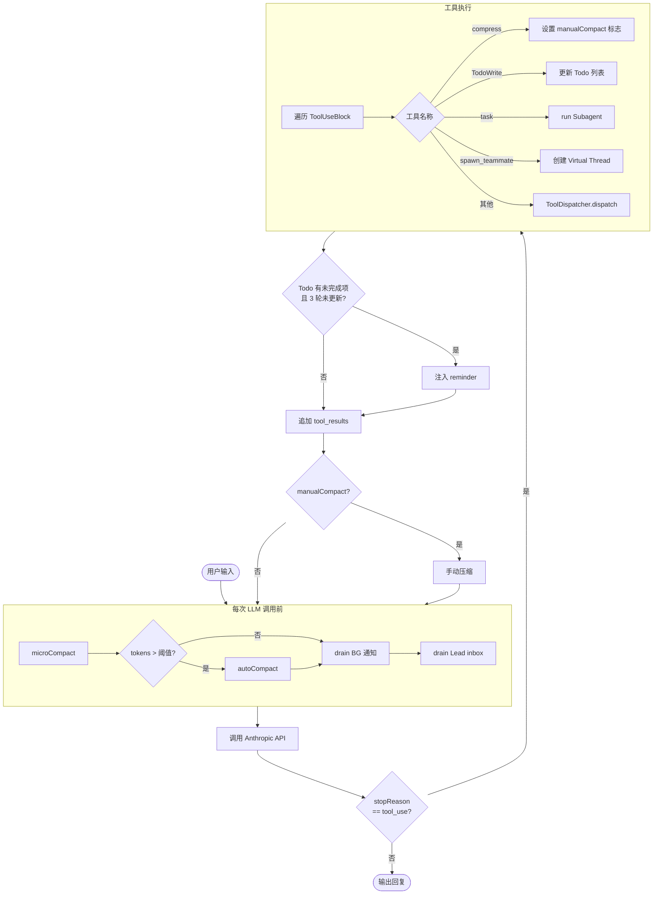

### 8.3 验收标准

- [ ] `SFullAgent` 启动后显示 REPL 提示符 `s_full >> `
- [ ] `/tasks` 命令正确列出所有任务
- [ ] `/team` 命令正确列出所有 Teammate 状态
- [ ] `/compact` 命令触发手动压缩，打印 `[manual compact via /compact]`
- [ ] 完整任务流测试：创建 3 个任务 → 生成 2 个 Teammate → 自主完成 → 所有任务 completed
- [ ] token 超过 100000 时自动压缩，`.transcripts/` 有记录

---

## 第9章 风险管理

### 9.1 风险矩阵

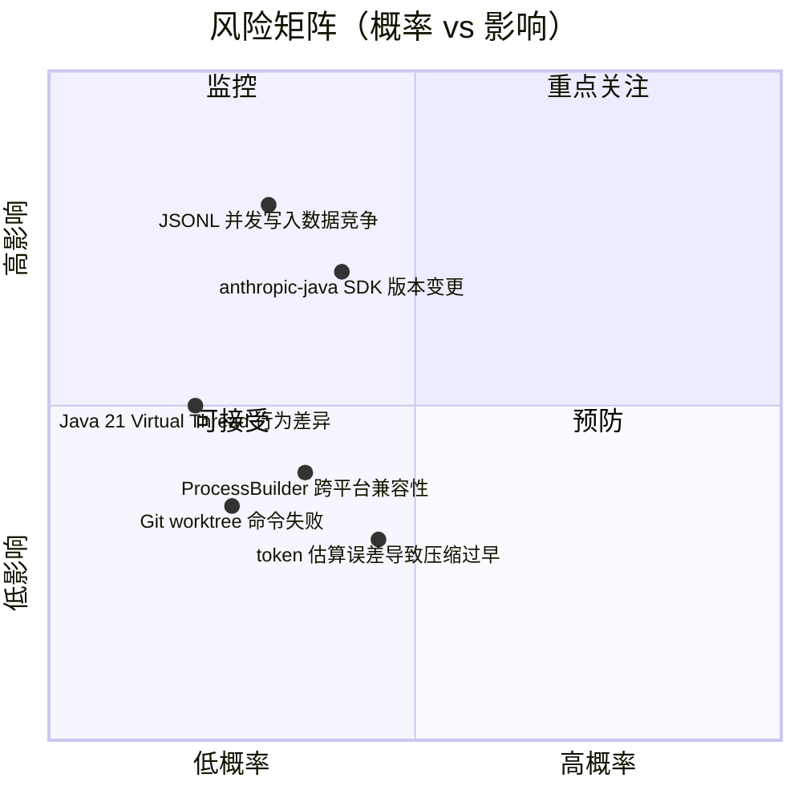

### 9.2 风险应对策略

| 风险 | 概率 | 影响 | 应对策略 |
|------|------|------|----------|
| anthropic-java SDK API 变更 | 低 | 高 | 封装 `AnthropicHelper` 隔离 SDK 调用，变更只需修改一处 |
| JSONL 并发写入数据竞争 | 中 | 高 | 每个 inbox 文件独立 `ReentrantLock`，用 `ConcurrentHashMap` 管理锁池 |
| ProcessBuilder 跨平台差异 | 中 | 中 | Windows 下使用 `cmd /c`，Unix 下使用 `bash -c`，运行时检测 OS |
| token 估算误差 | 中 | 低 | 估算阈值设置保守（50000），实际压缩有余量；同时支持手动 compact |
| Virtual Thread 调试困难 | 低 | 中 | 使用 SLF4J 结构化日志，每个线程设置有意义的名称 |
| Git worktree 命令失败 | 低 | 低 | 检查 git 可用性，失败时返回清晰错误信息而非崩溃 |

---

## 第10章 测试策略

### 10.1 测试层次

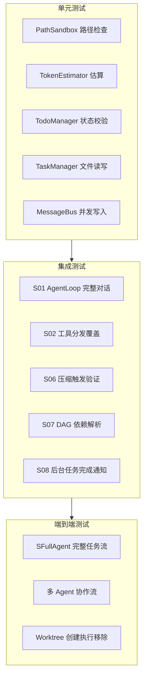

### 10.2 每阶段测试检查点

| 阶段 | 检查点 | 验证方式 |
|------|--------|----------|
| 阶段0 | 环境配置正确 | `mvn compile` 无错误 |
| 阶段1 | S01 REPL 可交互 | 手动输入 "list files"，验证 bash 工具返回目录内容 |
| 阶段2 | S06 压缩触发 | 注入超长消息历史，验证日志输出 `[auto_compact triggered]` |
| 阶段3 | S07 任务持久化 | 创建任务后检查 `.tasks/task_1.json` 文件存在且格式正确 |
| 阶段4 | S09 多 Agent 并发 | 同时运行 alice/bob，验证 inbox 无数据交叉 |
| 阶段5 | SFullAgent 完整流 | 3 任务 + 2 Teammate + 自主完成，全部 `completed` |

### 10.3 关键单元测试示例

**PathSandbox 测试：**

```java
@Test
void safePath_blocksEscape() {
    Path workdir = Path.of("/workspace");
    PathSandbox sandbox = new PathSandbox(workdir);
    assertThrows(SecurityException.class,
        () -> sandbox.safePath("../../../etc/passwd"));
}

@Test
void safePath_allowsInside() {
    Path workdir = Path.of("/workspace");
    PathSandbox sandbox = new PathSandbox(workdir);
    assertDoesNotThrow(() -> sandbox.safePath("src/main/App.java"));
}
```

**TaskManager DAG 测试：**

```java
@Test
void completeTask_unblocksDependents() throws Exception {
    TaskManager tm = new TaskManager(tempDir);
    int t1 = tm.create("Task A", "desc");
    int t2 = tm.create("Task B", "desc", List.of(t1));

    Task before = tm.get(t2);
    assertTrue(before.blockedBy().contains(t1));

    tm.update(t1, "status", "completed");

    Task after = tm.get(t2);
    assertFalse(after.blockedBy().contains(t1));
}
```

**MessageBus 并发写入测试：**

```java
@Test
void concurrentSend_noDataRace() throws Exception {
    MessageBus bus = new MessageBus(tempDir);
    int threadCount = 20;
    CountDownLatch latch = new CountDownLatch(threadCount);
    List<Thread> threads = new ArrayList<>();

    for (int i = 0; i < threadCount; i++) {
        int idx = i;
        threads.add(Thread.ofVirtual().start(() -> {
            bus.send("sender" + idx, "alice", "msg" + idx);
            latch.countDown();
        }));
    }
    latch.await(5, TimeUnit.SECONDS);

    List<String> lines = Files.readAllLines(tempDir.resolve("alice.jsonl"));
    assertEquals(threadCount, lines.size(),
        "Every concurrent send must produce exactly one JSONL line");
    // Verify each line is valid JSON
    for (String line : lines) {
        assertDoesNotThrow(() -> MAPPER.readTree(line));
    }
}
```

**ContextCompressor token 估算测试：**

```java
@Test
void estimateTokens_roughlyQuarterCharCount() {
    TokenEstimator est = new TokenEstimator();
    String text = "a".repeat(4000);
    long tokens = est.estimate(text);
    // expect ~1000, allow 20% tolerance
    assertTrue(tokens >= 800 && tokens <= 1200,
        "Token estimate should be ~charCount/4, got " + tokens);
}
```

---

## 第11章 编码规范与工程约定

### 11.1 Java 21 特性使用规范

| 特性 | 使用场景 | 示例 |
|------|----------|------|
| `sealed interface` | ContentBlock 类型层次 | `sealed interface ContentBlock permits TextBlock, ToolUseBlock, ToolResultBlock` |
| `record` | 不可变数据载体 | `record Task(int id, String subject, String status, List<Integer> blockedBy)` |
| `pattern matching` | ContentBlock 分支处理 | `if (block instanceof ToolUseBlock tub) { ... }` |
| `switch expression` | 工具名称路由 | `yield switch(tool) { case "bash" -> ... }` |
| Virtual Thread | 后台任务 / Teammate 线程 | `Thread.ofVirtual().name(name).start(runnable)` |
| `var` | 局部类型推断 | `var messages = new ArrayList<Map<String,Object>>()` |

### 11.2 命名约定

| 类型 | 约定 | 示例 |
|------|------|------|
| Session 主类 | `S0N` + 功能名 | `S01AgentLoop`, `S09AgentTeams` |
| 工具实现类 | 工具名 + `Tool` | `BashTool`, `ReadTool` |
| 工具接口 | `ToolHandler`（@FunctionalInterface） | `ToolHandler handler = input -> ...` |
| 工具分发器 | `ToolDispatcher` | 维护 `Map<String, ToolHandler>` |
| 运行时产物目录 | 与 Python 版完全一致 | `.tasks/`, `.team/`, `.transcripts/`, `.worktrees/` |

### 11.3 错误处理约定

- 工具执行异常统一 catch，返回 `"Error: " + e.getMessage()` 字符串（不向上抛出，不崩溃 Agent 循环）
- SDK 调用异常允许向上传播，由 AgentLoop 捕获并打印，然后中断本轮循环
- PathSandbox 违规抛出 `SecurityException`（运行时异常），在工具层 catch 后转为错误字符串
- 文件 I/O 操作均捕获 `IOException`，转为错误字符串

### 11.4 日志规范

使用 SLF4J + Logback，线程名格式：`agent-{name}` 或 `bg-task-{id}`

```java
// 工具调用日志（与 Python 原版对齐）
log.info("> {}: {}", toolName, output.substring(0, Math.min(200, output.length())));
// Teammate 工具调用日志
log.info("  [{}] {}: {}", agentName, toolName, output.substring(0, Math.min(120, output.length())));
// 压缩触发日志
log.info("[auto_compact triggered] tokens={}, saving transcript to {}", tokens, transcriptPath);
```

---

## 第12章 总结

### 12.1 实施路线回顾

本计划将 `learn-claude-code` 的 13 个 Python Agent 文件分 5 个阶段、8 周完成 Java 21 重写：

| 里程碑 | 产出 | 教学价值 |
|--------|------|----------|
| 阶段0 完成 | Maven 项目骨架 + 基础设施 | 理解环境搭建与类型建模 |
| 阶段1 完成 | S01+S02 可运行 REPL | 掌握 Agent 核心循环 |
| 阶段2 完成 | S03-S06 完整上下文管理 | 掌握规划/隔离/压缩机制 |
| 阶段3 完成 | S07+S08 持久化与并发 | 掌握文件系统即数据库 |
| 阶段4 完成 | S09-S12 多 Agent 团队 | 掌握分布式 Agent 协作 |
| 阶段5 完成 | SFullAgent 全量整合 | 掌握完整 Agent 工程体系 |

### 12.2 Java 重写的额外收益

1. **类型安全**：`sealed interface ContentBlock` 使编译器强制处理所有消息类型，Python 版依赖运行时 `block.type` 字符串判断。
2. **并发性能**：Java 21 Virtual Thread 在 I/O 密集场景（多 Teammate 并发）下性能优于 Python GIL 限制下的 `threading.Thread`。
3. **工程可维护性**：强类型、IDE 重构支持、编译期错误检测，适合团队协作和长期维护。
4. **企业级教学**：Java 版本更贴近企业实际技术栈，适合 Java 后端工程师学习 Agent 开发。

### 12.3 下一步行动

1. **立即**：按阶段0清单搭建 Maven 项目骨架，验证 `anthropic-java` SDK 连通性
2. **第1周末**：完成 S01，在 REPL 中完成第一次 Agent 对话
3. **持续**：每完成一课，对比 Python 原版，确认行为一致性
4. **完成后**：将 Java 版实现回写到 `vendors/learn-claude-code-java/`，与原 Python 版并排展示

---

*文档生成时间：2026-03-27*
*依据文档：`specs/java-rewrite-analysis.md`、`specs/learn-claude-code-arch.md`*
*源码参考：`vendors/learn-claude-code/agents/`*
