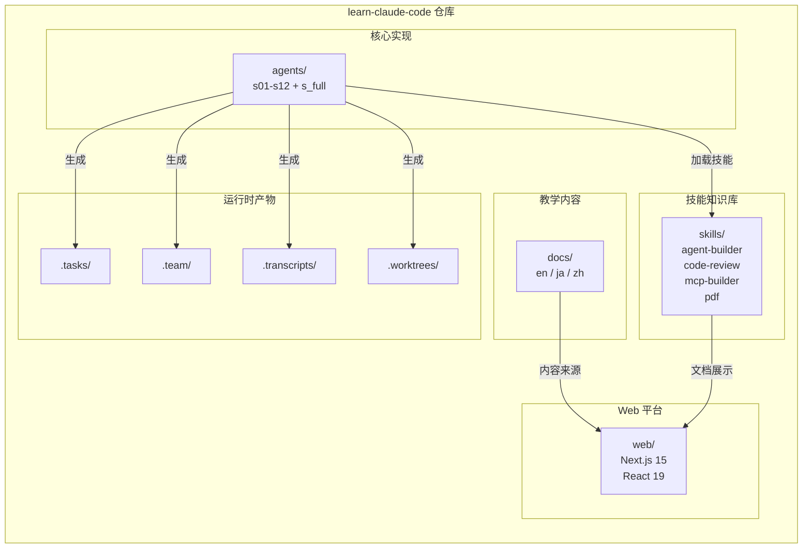
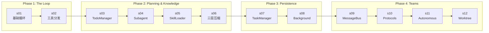
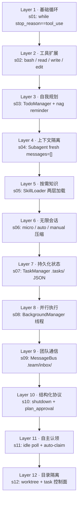
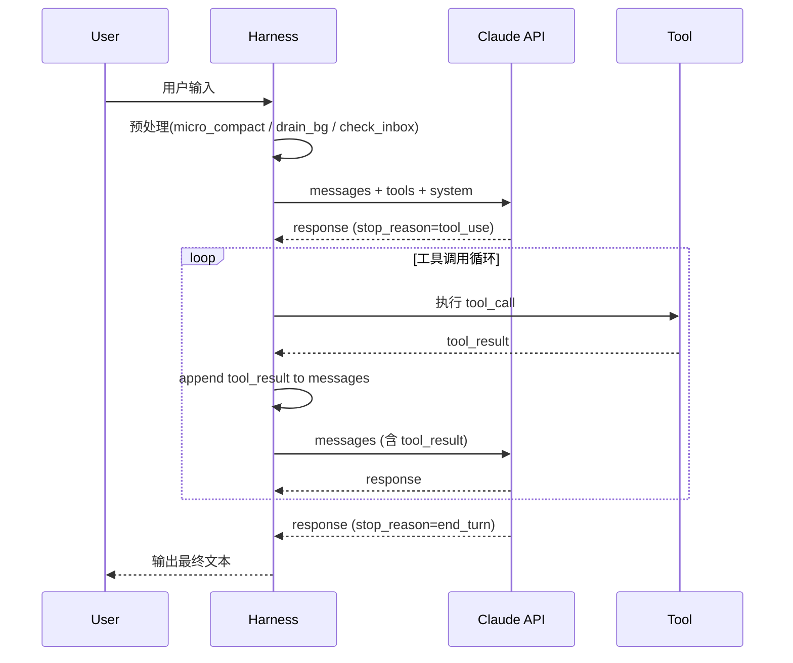
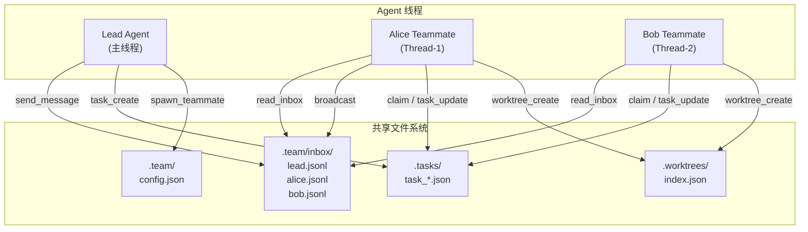
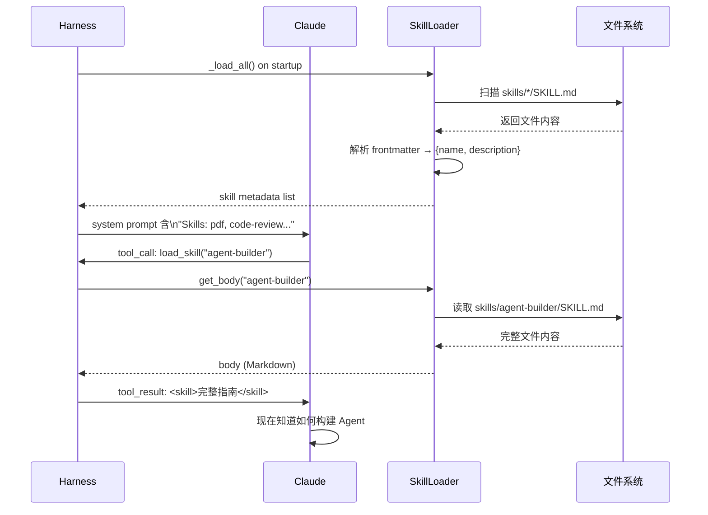
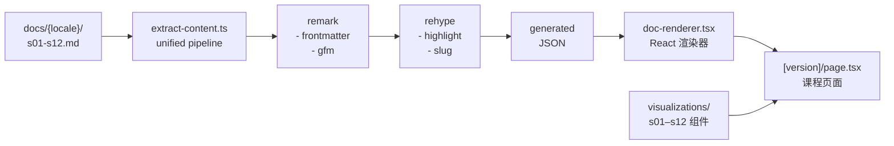
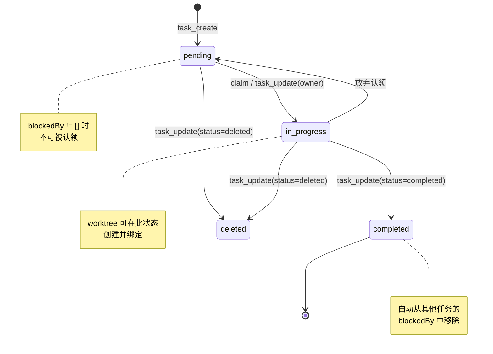

# learn-claude-code 架构分析

> 本文档对 `vendors/learn-claude-code` 项目进行深度架构分析。
> 该项目通过 12 个渐进式课程（s01–s12）逆向工程 Claude Code 的核心架构，
> 核心理念为 **"The Model IS the Agent"**——模型本身就是 Agent，代码只是提供运行环境。

---

## 第 1 章：项目概览与设计哲学

### 1.1 项目定位

`learn-claude-code` 是一个 **0-to-1 教育仓库**，目标是通过逆向工程 Claude Code 的方式，让开发者彻底理解 AI Agent 的工作原理。它不讲理论，而是用最精简的代码逐层展示：从 108 行的基础循环（s01），到 737 行的全机制整合（s_full.py），每一课只增加一个新概念，没有废话。

### 1.2 核心哲学：The Model IS the Agent

> *"The model already knows how to be an agent. Your job is to get out of the way."*

这是整个项目最重要的一句话。传统软件思维倾向于用代码编排行为，而这个项目揭示了一个反直觉的事实：**模型（LLM）本身就具备 Agent 能力**，开发者需要做的不是编写复杂的逻辑，而是提供最小必要的运行支撑——Harness。

三个关键推论：

1. **Agent = Loop + Tools**：核心循环只有 5 行，其余都是可选增强。
2. **Intelligence is in the model, not the code**：代码只负责执行工具调用，决策完全由模型完成。
3. **Context is the agent's memory**：消息历史就是工作记忆，保护其清晰度是 Harness 的核心职责。

### 1.3 Harness Engineering 范式

每个 Agent 文件的首行注释都遵循同一格式：

```
# Harness: <机制名> -- <对模型的作用>
```

例如：
- `s01`: `Harness: the loop -- the model's first connection to the real world.`
- `s04`: `Harness: context isolation -- protecting the model's clarity of thought.`
- `s06`: `Harness: compression -- clean memory for infinite sessions.`

Harness 的设计原则：**最小必要支撑代码**。凡是模型自己能做的判断，就不用代码去写死；凡是需要外部执行的动作（文件读写、Shell 命令），才由 Harness 提供工具实现。

### 1.4 技术栈总览

| 层次 | 技术 | 用途 |
|------|------|------|
| Agent 运行时 | Python + `anthropic` SDK | 核心循环与工具执行 |
| 环境管理 | `python-dotenv` | API Key / BASE_URL 注入 |
| Web 平台 | Next.js 15 / React 19 | 交互式教学网站 |
| 样式 | Tailwind CSS 4 | UI 样式 |
| 国际化 | 自研 `i18n.tsx` | 英/日/中三语言 |
| 内容管道 | unified / remark / rehype | Markdown → JSON |


---

## 第 2 章：仓库目录结构与模块关系

### 2.1 五大顶层目录职责

| 目录 | 职责 |
|------|------|
| `agents/` | 12 课 Python Agent 实现 + `s_full.py` 全量参考实现 |
| `docs/` | 三语言（en/ja/zh）教学文档，每课一个 Markdown 文件 |
| `skills/` | 四个内置技能：`agent-builder`、`code-review`、`mcp-builder`、`pdf` |
| `web/` | Next.js 交互式教学平台，含可视化组件与内容管道 |
| `.github/` | CI/CD 配置（workflows） |

### 2.2 运行时产物目录

这些目录在 Agent 运行时动态生成，不提交到 Git：

| 目录 | 产生时机 | 内容格式 |
|------|----------|----------|
| `.tasks/` | s07+ TaskManager 创建任务时 | `task_{id}.json`，含 status/blockedBy/blocks |
| `.team/` | s09+ 团队协作时 | `config.json`（团队配置）+ `inbox/{name}.jsonl`（消息队列）|
| `.transcripts/` | s06+ 上下文压缩触发时 | 完整对话历史存档 |
| `.worktrees/` | s12+ Worktree 隔离时 | `index.json`（worktree 注册表）|

### 2.3 图表 ① 项目模块关系图




---

## 第 3 章：十二课学习路径与四阶段演进

### 3.1 四阶段概览

| 阶段 | 课程 | 主题 | 核心洞察 |
|------|------|------|----------|
| Phase 1: The Loop | s01–s02 | 基础循环与工具分发 | 循环本身就是一切 |
| Phase 2: Planning & Knowledge | s03–s06 | 规划、知识、压缩 | 模型能管理自己的状态 |
| Phase 3: Persistence | s07–s08 | 任务系统与后台执行 | 状态外化到文件系统 |
| Phase 4: Teams | s09–s12 | 多 Agent 协作 | 模型是团队成员，代码是邮局 |

### 3.2 每课核心概念速查

| 课程 | 新增机制 | 核心洞察引言 |
|------|----------|-------------|
| s01 | `while stop_reason==tool_use` 循环 | "The loop is the entire secret" |
| s02 | `TOOL_HANDLERS` 分发映射 | "The loop didn't change at all. I just added tools." |
| s03 | `TodoManager` + nag reminder | "The agent can track its own progress -- and I can see it." |
| s04 | Subagent 进程隔离 | "Process isolation gives context isolation for free." |
| s05 | `SkillLoader` 两层加载 | "Don't put everything in the system prompt. Load on demand." |
| s06 | micro / auto / manual 三层压缩 | "The agent can forget strategically and keep working forever." |
| s07 | `TaskManager` + `blockedBy` 依赖图 | "State that survives compression -- because it's outside the conversation." |
| s08 | `BackgroundManager` 线程池 | "Fire and forget -- the agent doesn't block while the command runs." |
| s09 | `MessageBus` JSONL 邮箱 | "Models share a filesystem, not a mind." |
| s10 | shutdown / plan_approval 协议 | `request_id` 关联握手模式 |
| s11 | 自主认领 + 身份重注入 | "The agent finds work itself." |
| s12 | Worktree 目录隔离 | "Isolate by directory, coordinate by task ID." |

### 3.3 图表 ② 学习路径演进图



### 3.4 图表 ③ 能力层叠加图（自底向上）




---

## 第 4 章：Agent 核心架构逐层解析

### 4.1 Phase 1: The Loop（s01–s02）

**s01** 用 108 行代码展示了 Agent 的本质——一个 `while` 循环：

```python
# s01_agent_loop.py 核心模式
while True:
    response = client.messages.create(model=MODEL, messages=messages, tools=TOOLS)
    messages.append({"role": "assistant", "content": response.content})
    if response.stop_reason != "tool_use":  # 模型决定停止
        return
    results = []
    for block in response.content:
        if block.type == "tool_use":
            output = run_bash(block.input["command"])  # 执行工具
            results.append({"type": "tool_result", "tool_use_id": block.id, "content": output})
    messages.append({"role": "user", "content": results})  # 结果喂回模型
```

**s02** 在不改变循环结构的前提下，引入 `TOOL_HANDLERS` 字典实现多工具分发：

```python
TOOL_HANDLERS = {
    "bash": run_bash,
    "read": run_read,
    "write": run_write,
    "edit": run_edit,
}
output = TOOL_HANDLERS[block.name](**block.input)
```

### 4.2 Phase 2: Planning & Knowledge（s03–s06）

**s03 TodoManager**：模型通过 `todo` 工具写入结构化任务列表，Harness 统计 `rounds_since_todo`，超过 3 轮未更新则自动注入 `<reminder>` 提醒。最多 20 条、同时最多 1 条 `in_progress`。

**s04 Subagent**：父 Agent 调用 `task` 工具时，Harness 用 `subprocess` 启动子进程，子进程拥有全新的 `messages=[]`。子进程完成后只返回最后一段文本给父 Agent，父 Agent 上下文保持干净。关键等式：**进程隔离 = 上下文隔离**。

**s05 SkillLoader**：扫描 `skills/*/SKILL.md`，解析 YAML frontmatter 提取 `name` 和 `description`，仅将元数据注入 system prompt（Layer 1，~100 tokens/skill）。模型调用 `load_skill(name)` 时，才将完整 SKILL.md body 作为 `tool_result` 返回（Layer 2，按需加载）。

**s06 三层压缩**：
- **Layer 1 micro_compact**：每轮静默执行，将 3 轮前的 `tool_result` 内容替换为 `"[Previous: used {tool_name}]"`
- **Layer 2 auto_compact**：token 估算超过 50000 时，将完整对话存入 `.transcripts/`，调用 LLM 生成摘要，以摘要替换全部消息
- **Layer 3 manual compact**：模型主动调用 `compact` 工具触发，与 auto_compact 逻辑相同

### 4.3 Phase 3: Persistence（s07–s08）

**s07 TaskManager**：任务以 JSON 文件持久化到 `.tasks/task_{id}.json`，结构包含 `id / subject / description / status / owner / blockedBy / blocks`。完成任务时自动从依赖它的任务的 `blockedBy` 列表中移除。**状态在上下文压缩后依然存活**，因为它在文件系统而非消息历史中。

**s08 BackgroundManager**：用 Python `threading.Thread` 启动后台命令，立即返回 `task_id`。每次 LLM 调用前，从 `_notification_queue` 中取出已完成任务的结果，作为额外的 `tool_result` 注入消息历史，实现"结果在下一轮自动出现"。

### 4.4 Phase 4: Teams（s09–s12）

**s09 MessageBus**：`.team/inbox/{name}.jsonl` 是每个 Agent 的邮箱。`send_message` 追加写入，`read_inbox` 读取后清空（drain 语义）。`TeamManager` 维护 `.team/config.json`，记录每个成员的 `name / role / status / pid`。每个 Teammate 在独立线程中运行自己的 `agent_loop`。

**s10 Protocols**：两个握手协议，均使用 `request_id` 关联请求与响应：
- **Shutdown FSM**：`pending → approved | rejected`，Lead 发送 `shutdown_request`，Teammate 回复 `shutdown_response`
- **Plan Approval FSM**：`pending → approved | rejected`，Teammate 发送 `plan_approval`，Lead 审批后回复

**s11 Autonomous**：Teammate 进入 idle 后，每 5 秒轮询一次：先检查 inbox 是否有新消息，再扫描 `.tasks/` 寻找 `status=pending` 且无 owner 的任务自动认领。60 秒无任务则自动关机。上下文压缩后重新注入身份块（`"You are 'coder', role: backend"`）防止模型失忆。

**s12 Worktree**：任务（`.tasks/`）是控制面，Worktree（`.worktrees/`）是执行面。`worktree_create` 调用 `git worktree add`，将 task_id 写入 `index.json`。每个任务在独立目录（独立 git branch）中执行，彼此不干扰。

### 4.5 s_full.py 全机制整合

`s_full.py`（737 行）是 s01–s11 所有机制的整合参考实现（s12 单独教学）。每次 LLM 调用前执行三步预处理：

1. **micro_compact**：静默压缩旧 tool_result
2. **drain background**：注入后台任务完成通知
3. **check inbox**：注入来自其他 Agent 的消息

工具集涵盖 26 个工具：`bash / read / write / edit / todo / task / load_skill / compress / background_run / background_check / task_create / task_get / task_update / task_list / spawn_teammate / list_teammates / send_message / read_inbox / broadcast / shutdown / plan / idle / claim` 等。

### 4.6 图表 ④ Agent 循环核心序列图



### 4.7 图表 ⑤ 多 Agent 通信架构图




---

## 第 5 章：Skills 技能系统深度解析

### 5.1 SKILL.md 规范

每个技能由一个目录组成，核心文件是 `SKILL.md`，格式为 YAML frontmatter + Markdown body：

```markdown
---
name: agent-builder
description: |
  Design and build AI agents for any domain. Use when users:
  (1) ask to "create an agent"...
  Keywords: agent, assistant, autonomous...
---

# Agent Builder

## The Core Philosophy
> The model already knows how to be an agent...
```

- **frontmatter**：`name`（技能标识符）+ `description`（触发条件描述，用于 Layer 1 注入）
- **body**：完整的操作指南、反模式、资源引用（用于 Layer 2 按需加载）

### 5.2 两层加载机制

| 层次 | 触发时机 | 注入位置 | Token 成本 |
|------|----------|----------|------------|
| Layer 1 元数据 | Agent 启动时 | system prompt | ~100 tokens/skill |
| Layer 2 完整内容 | 模型调用 `load_skill(name)` | tool_result | 完整 SKILL.md body |

`SkillLoader._load_all()` 扫描 `skills/*/SKILL.md`，用正则提取 frontmatter：

```python
pattern = r'^---\s*\n(.*?)\n---\s*\n(.*)'
match = re.match(pattern, content, re.DOTALL)
# group(1) -> YAML frontmatter -> name + description
# group(2) -> body -> 按需返回
```

### 5.3 四个内置技能分析

| 技能名 | 触发场景 | 附带资源 |
|--------|----------|----------|
| `agent-builder` | 创建 Agent、理解 Agent 架构 | `references/`（philosophy、minimal-agent、tool-templates、subagent-pattern）+ `scripts/init_agent.py` |
| `code-review` | 代码审查请求 | 仅 SKILL.md |
| `mcp-builder` | 构建 MCP 服务器 | 仅 SKILL.md |
| `pdf` | 处理 PDF 文件 | 仅 SKILL.md |

`agent-builder` 是最复杂的技能，其 references 目录包含可直接运行的 Python 模板，供模型在生成新 Agent 时参考。

### 5.4 图表 ⑥ 技能加载流程序列图




---

## 第 6 章：Web 交互平台架构

### 6.1 Next.js App Router 路由设计

```
web/src/app/
├── page.tsx                          # 根重定向 → /en
├── [locale]/
│   ├── layout.tsx                    # 语言级布局（html lang 属性）
│   ├── page.tsx                      # 首页（语言选择/跳转）
│   └── (learn)/
│       ├── layout.tsx                # 学习区布局（导航栏）
│       ├── [version]/
│       │   ├── page.tsx              # 课程主页（s01–s12 + s_full）
│       │   ├── client.tsx            # 客户端交互逻辑
│       │   └── diff/
│       │       ├── page.tsx          # 课程差异对比页
│       │       └── diff-content.tsx  # 差异渲染组件
│       ├── compare/page.tsx          # 多版本横向对比
│       ├── layers/page.tsx           # 能力层可视化
│       └── timeline/page.tsx         # 学习时间线
```

`[locale]` 支持 `en / ja / zh` 三种语言，`[version]` 对应 `s01`–`s12` 及 `s_full`。

### 6.2 内容管道

内容从 Markdown 源文件经过多步转换生成可渲染的 JSON：

```
docs/{locale}/s01-the-agent-loop.md
        ↓
extract-content.ts (unified pipeline)
        ↓  remark-frontmatter / remark-gfm
        ↓  rehype-highlight / rehype-slug
        ↓
generated JSON (title, sections, codeBlocks, metadata)
        ↓
doc-renderer.tsx → React 组件树
```

`doc-renderer.tsx` 是核心渲染器，将 JSON 结构映射为带语法高亮的 Markdown 视图，并在每个课程页面嵌入对应的交互式可视化组件。

### 6.3 交互式可视化组件体系

每门课程（s01–s12）都有对应的 React 可视化组件，位于 `web/src/components/visualizations/`：

| 组件 | 可视化内容 |
|------|------------|
| `s01-agent-loop.tsx` | Agent 循环动画（AgentLoopSimulator）|
| `s02-tool-dispatch.tsx` | 工具分发映射交互图 |
| `s03-todo-write.tsx` | TodoManager 状态实时展示 |
| `s04-subagent.tsx` | 父/子 Agent 上下文隔离演示 |
| `s05-skill-loading.tsx` | 两层加载流程步骤动画 |
| `s06-context-compact.tsx` | 三层压缩 token 变化可视化 |
| `s07-task-system.tsx` | 任务依赖图（DAG）渲染 |
| `s08-background-tasks.tsx` | 并行执行时间线 |
| `s09-agent-teams.tsx` | 团队通信消息流 |
| `s10-team-protocols.tsx` | 握手协议状态机动画 |
| `s11-autonomous-agents.tsx` | Idle 轮询与自主认领流程 |
| `s12-worktree-task-isolation.tsx` | Worktree 隔离目录结构 |

架构组件（`components/architecture/`）提供全局视图：`arch-diagram`、`execution-flow`、`message-flow`、`design-decisions`。

### 6.4 图表 ⑦ Web 内容管道数据流




---

## 第 7 章：数据流与状态管理

### 7.1 `.tasks/` 任务 JSON 格式

```json
{
  "id": 3,
  "subject": "实现用户认证模块",
  "description": "使用 JWT 实现登录/登出接口",
  "status": "in_progress",
  "owner": "alice",
  "blockedBy": [],
  "blocks": [4, 5],
  "worktree": "auth-refactor"
}
```

**状态流转**：`pending → in_progress → completed`（也可 `deleted`）

**依赖语义**：`blockedBy` 列出前置任务 ID；任务完成时，TaskManager 自动将其 ID 从所有其他任务的 `blockedBy` 列表中移除，使后续任务解锁。

### 7.2 `.team/` JSONL 邮箱协议

每条消息是一行 JSON（JSONL append-only）：

```json
{"type": "message", "from": "lead", "to": "alice", "content": "请修复登录 bug", "timestamp": 1234567890}
{"type": "shutdown_request", "from": "lead", "to": "bob", "request_id": "abc123"}
{"type": "shutdown_response", "from": "bob", "to": "lead", "request_id": "abc123", "approve": true}
{"type": "broadcast", "from": "alice", "content": "认证模块完成"}
{"type": "plan_approval_response", "from": "lead", "request_id": "xyz789", "approve": true}
```

五种消息类型：`message / broadcast / shutdown_request / shutdown_response / plan_approval_response`

`read_inbox` 语义是 **drain**：读取后清空文件，防止重复消费。

### 7.3 `.worktrees/index.json` 隔离执行索引

```json
{
  "worktrees": [
    {
      "name": "auth-refactor",
      "path": "/repo/.worktrees/auth-refactor",
      "branch": "wt/auth-refactor",
      "task_id": 3,
      "status": "active"
    }
  ]
}
```

每个 worktree 绑定一个 task_id，实现**任务（控制面）⟷ 目录（执行面）**的双向追踪。

### 7.4 图表 ⑧ 任务状态机




---

## 第 8 章：架构总结与设计模式提炼

### 8.1 12 个关键设计模式

| # | 模式名称 | 首次出现 | 核心价值 |
|---|----------|----------|----------|
| 1 | **Agent Loop** | s01 | `while stop_reason==tool_use` 是一切的基础 |
| 2 | **Tool Dispatch Map** | s02 | `dict[name → fn]` 解耦工具注册与调用 |
| 3 | **Self-Tracking with Nag** | s03 | 模型写自己的 todo，Harness 督促更新 |
| 4 | **Process = Context Isolation** | s04 | subprocess 天然隔离上下文，无需额外设计 |
| 5 | **Two-Layer Knowledge Injection** | s05 | 元数据常驻 system prompt，body 按需加载 |
| 6 | **Tiered Compression** | s06 | micro（静默）→ auto（阈值）→ manual（主动）三层防线 |
| 7 | **Filesystem as Database** | s07 | JSON 文件比内存 dict 更持久，比数据库更简单 |
| 8 | **Fire-and-Forget + Notification Queue** | s08 | 后台线程执行，下一轮 LLM 调用前注入结果 |
| 9 | **JSONL Mailbox (drain semantics)** | s09 | append-only 写入，read 即清空，天然的消息队列 |
| 10 | **request_id Correlation** | s10 | 无状态消息中用 UUID 关联请求与响应 |
| 11 | **Idle Poll + Auto-Claim** | s11 | Agent 主动找工作，而非被动等待分配 |
| 12 | **Control Plane / Execution Plane Split** | s12 | Task（控制）与 Worktree（执行）解耦，通过 task_id 关联 |

### 8.2 从单体到分布式的渐进路线

```
s01-s02  单进程单模型，同步执行
    ↓
s03-s06  单进程单模型，有规划/隔离/压缩能力
    ↓
s07-s08  单进程单模型，有持久状态和并行后台
    ↓
s09-s10  多进程多模型，有通信协议和握手
    ↓
s11-s12  完全自主的分布式 Agent 团队，任务自治 + 目录隔离
```

每一步都是**最小增量**：新概念只增加一个类或一个机制，其余代码不变。这正是 Harness Engineering 范式的精髓。

### 8.3 与 Claude Code 真实架构的映射

| learn-claude-code 概念 | Claude Code 对应实现 |
|------------------------|---------------------|
| `while stop_reason==tool_use` | Claude Code 核心 Agent 循环 |
| `TOOL_HANDLERS` | 内置工具集（Bash/Read/Write/Edit/Glob/Grep 等）|
| `TodoManager` | `TaskCreate/TaskUpdate/TaskList` 工具 |
| `Subagent` subprocess | `Agent` 工具（subagent_type 参数）|
| `SkillLoader` | `Skill` 工具 + skills 目录 |
| `micro_compact` | 自动上下文压缩机制 |
| `TaskManager` .tasks/ | `TaskCreate/TaskGet/TaskUpdate` 持久化 |
| `BackgroundManager` | `run_in_background` 参数 |
| `MessageBus` JSONL | Agent 间 `SendMessage` 工具 |
| `shutdown` / `plan` 协议 | 多 Agent 协作协议 |
| `worktree` 隔离 | `EnterWorktree` / `ExitWorktree` 工具 |

### 8.4 核心结论

> **The Model IS the Agent. The code is just the harness.**

`learn-claude-code` 用 12 课、约 3000 行 Python，完整还原了 Claude Code 的核心架构思路。它证明了：

1. **Agent 不复杂**：核心循环 5 行，其余都是可选增强。
2. **文件系统是最好的数据库**：JSON 文件、JSONL 邮箱、worktree 索引——简单、持久、可调试。
3. **隔离是并行的基础**：进程隔离（subagent）、目录隔离（worktree）、上下文隔离（压缩）——三种隔离解决三个层次的问题。
4. **协议比框架更持久**：`request_id` 握手、drain 语义、nag reminder——这些简单约定比任何框架都更稳定。

---

*文档生成时间：2026-03-26*
*源码位置：`vendors/learn-claude-code/`*


